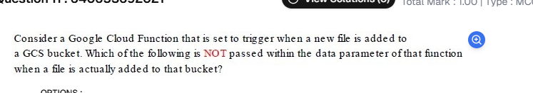

Bucket name of the added file

Name of the added file

Time of creation of the file

Event type of the triggered event

"Time of creation of the file"

Explanation:
When a Google Cloud Function is triggered by a new file being added to a Google Cloud Storage (GCS) bucket, the event data (payload) passed to the function includes:

✅ Bucket name – The name of the bucket where the file was added.
✅ Name of the added file – The specific name of the file that triggered the event.
✅ Event type – The type of event that triggered the function (e.g., "OBJECT_FINALIZE" for a new file addition).

However, the "time of creation of the file" is NOT included in the event payload. Instead, the event may contain the updated timestamp, which represents the last modification time, but not necessarily the original creation time.

Thus, the correct answer is:
"Time of creation of the file" 🚀

