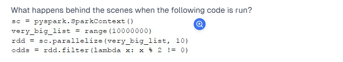

Options :

All odd numbers are computed

The program throws an error

Nothing is computed

Nothing is computed."

Explanation:
Creating SparkContext

python
'sc = pyspark.SparkContext()'
This initializes the Spark context, which is required to create RDDs and execute Spark jobs.
Defining a Large List.(RDDs are parallel data structures that enable users to persist intermediate data in memory and manipulate them using various operators. It also controls the partitioning of the data to optimize data placement.)

python
very_big_list = range(10000000)
This creates a range object representing numbers from 0 to 9,999,999.
Parallelizing the Data

python
rdd = sc.parallelize(very_big_list, 10)
The list is distributed across 10 partitions, creating an RDD.
Applying a Transformation (Filter Operation)

python
odds = rdd.filter(lambda x: x % 2 != 0)
This applies a lazy transformation to filter out odd numbers.
Why is "Nothing is computed"?
RDD transformations in Spark are lazy.
The filter() function only defines the transformation but does not execute it immediately.
Computation only happens when an action (like collect(), count(), foreach(), etc.) is called.
If no action is applied, Spark does not execute anything.
Thus, "Nothing is computed" is the correct answer. ✅

