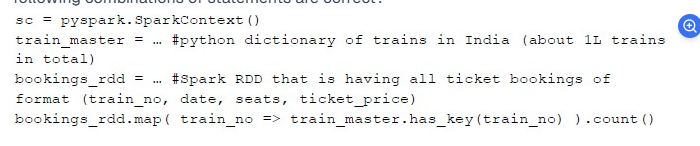

Consider the program outline as below running on a Spark cluster of 1 driver and 4 worker nodes with 2 executors per worker node: Consider the below mutually-exclusive characterisations about the program: i. Program will not run since RDD transformation operation map() runs on Executors that is referencing a variable train_master which is declared in the Spark driver ii. Program will run successfully and produce the count of bookings that match for trains present in the train_master For either of the 2 characterizations, consider the following (one or more) actions you could carry out in order to improve on the characterizations: 1. Program will need to be changed to bring the train_master into the Closure for executors to pick it up 2. Program will perform more poorly as the number of executors per worker node increases. Broadcast of train_master will need to be used to make it perform better. 3. Program will perform more poorly as the number of worker nodes increases (keeping number of executors per worker node constant). Broadcast of train_master will need to be used to make it perform better. Which of the following combinations of statements are correct?

Options :

i & 1

i & 1 followed by 2

i & 1 followed by 2 & 3

ii & 2

ii & 2 & 3

ii & 3

i & 1 followed by 2 & 3
Explanation:
Understanding the Problem:
The train_master dictionary is declared in the driver.
bookings_rdd.map(...) is an RDD transformation running on executors.
The function inside map() is referencing train_master, but since RDD transformations execute in parallel on worker nodes (executors), they cannot directly access driver-side variables like train_master.
Analysis of the Statements:
Statement i is correct

The program will not run because train_master is on the driver, and executors cannot directly access it.
Statement 1 is correct

To fix the issue, train_master must be sent to executors as part of the function closure (though this is inefficient for large datasets).
Statement 2 is correct

As the number of executors increases, each executor will have to individually fetch the large train_master dictionary, leading to performance degradation.
Solution: Use broadcast variables to efficiently distribute train_master to all executors.
Statement 3 is correct

As the number of worker nodes increases, the issue persists or worsens, because train_master is separately copied to all nodes.
Again, broadcasting is the optimal solution.
Why Not ii?
The program will not run in its current form (as per Statement i), so ii cannot be correct.
Thus, the best answer is:
i & 1 followed by 2 & 3 ✅