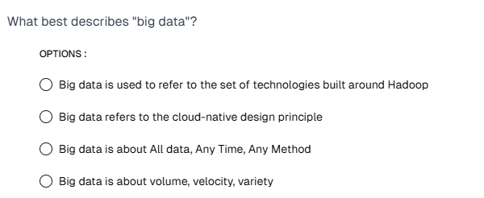

What best describes "big data"?

Options :

Big data is used to refer to the set of technologies built around Hadoop

Big data refers to the cloud-native design principle

Big data is about All data, Any Time, Any Method

Big data is about volume, velocity, variety

Answer : Big data is about volume, velocity, variety