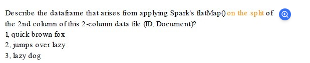

Options :

Set of lines one for each ID

Set of words one for each occurrence against each ID

Set of words one for each unique occurrence across IDs

Set of lists where each line becomes a list of words

"Set of words one for each occurrence against each ID."

Explanation:
The flatMap() function in Spark is used to apply a function that splits each element into multiple elements.
Here, the operation is performed on the 2nd column (Document), and the function splits each document into words.
The resulting DataFrame will have multiple rows, where each word is associated with the original ID.

Breakdown of the transformation:
ID	Document
1	quick brown fox
2	jumps over lazy
3	lazy dog
After applying flatMap() with .split(" "):

ID	Word
1	quick
1	brown
1	fox
2	jumps
2	over
2	lazy
3	lazy
3	dog
Each word occurrence is retained, not just unique words, and the words are mapped to their respective IDs. This matches the correct option:

✅ Set of words one for each occurrence against each ID.