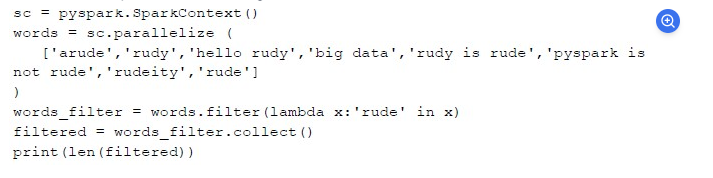

    What is the output of the following code?

Options :

1

5

3

6

sc = pyspark.SparkContext()
words = sc.parallelize(
    ['arude', 'rudy', 'hello rudy', 'big data', 'rudy is rude', 'pyspark is not rude', 'rudeity', 'rude']
)

words_filter = words.filter(lambda x: 'rude' in x)
filtered = words_filter.collect()
print(len(filtered))

Step-by-step execution:
Parallelizing Data:
The list of words is distributed as an RDD.

Filtering Condition:
The filter condition lambda x: 'rude' in x selects elements that contain the substring "rude".

Checking Elements:
The words containing "rude" are:

'arude'
'rudy is rude'
'pyspark is not rude'
'rudeity'
'rude'
Filtered list: ['arude', 'rudy is rude', 'pyspark is not rude', 'rudeity', 'rude']

Counting the Filtered Elements:
len(filtered) = 5

Answer:
The output will be 5, so the correct option is:

5 ✅

